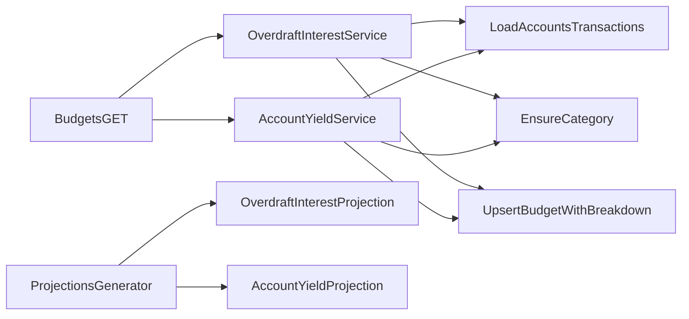

# Cheque Especial e Rendimento no Orçamento/Projeções

## Escopo e premissas

- Cálculo de juros **composto diário** com taxa a.m convertida em taxa diária: `(1 + taxa_mensal)^(1/30) - 1`.
- Juros calculados sobre o saldo diário negativo, **limitado ao valor do limite** quando aplicável (para evitar juros acima do limite).
- Rendimento segue a **mesma lógica** no saldo positivo (composto diário), gerando valor em categoria de receita.
- Orçamento de juros/rendimento é gerado **uma vez** para o mês seguinte ao mês fechado; se o orçamento já existir, não sobrescreve (mantém edição do usuário).
- Projeções devem **criar/remover** juros/rendimento automaticamente conforme o saldo projetado do mês base ficar negativo/positivo.

## Fluxo proposto

## Alterações por camada

### 1) Banco de dados

- Criar migration adicionando campos em `accounts`:
- `overdraft_limit_cents BIGINT DEFAULT 0`
- `overdraft_interest_rate_monthly NUMERIC(6,3) DEFAULT 0`
- `yield_rate_monthly NUMERIC(6,3) DEFAULT 0`
- Comentários nas colunas
- Arquivo sugerido: [`supabase/migrations/0xx_add_overdraft_fields.sql`](supabase/migrations/0xx_add_overdraft_fields.sql)

### 2) Validação e API de contas

- Atualizar `accountSchema` em [`src/lib/validation/schemas.ts`](src/lib/validation/schemas.ts) para aceitar:
- `overdraft_limit_cents` (opcional, >= 0)
- `overdraft_interest_rate_monthly` (opcional, >= 0)
- `yield_rate_monthly` (opcional, >= 0)
- Refinement: se `overdraft_limit_cents > 0`, exigir taxa > 0.
- Ajustar criação/edição de contas para persistir novos campos:
- [`src/app/api/accounts/route.ts`](src/app/api/accounts/route.ts)
- `[src/app/api/accounts/[id]/route.ts](src/app/api/accounts/[id]/route.ts)`

### 3) Serviço de juros de cheque especial

- Criar serviço dedicado em [`src/services/budgets/overdraftInterest.ts`](src/services/budgets/overdraftInterest.ts) com:
- Busca de contas elegíveis (limite > 0 e taxa > 0; ignorar `credit_card`).
- Reconstrução do saldo diário via transações (usando `current_balance` como âncora, iterando datas para trás).
- Cálculo de juros compostos por dia (acumulando em centavos e arredondando por dia).
- Garantir categoria `Juros - Limite` (tipo `expense`, `source_type = 'general'`), criando se não existir.
- Preparar `metadata.budget_breakdown.items` com sub-itens por conta (label = nome da conta, amount_cents = juros da conta).
- Inserir orçamento do mês alvo apenas se não existir (para manter edição manual).

### 4) Serviço de rendimento da conta

- Criar serviço dedicado em [`src/services/budgets/accountYield.ts`](src/services/budgets/accountYield.ts) com:
- Busca de contas elegíveis (yield_rate_monthly > 0; ignorar `credit_card`).
- Reconstrução do saldo diário via transações (usando `current_balance` como âncora, iterando datas para trás).
- Cálculo de rendimento composto diário sobre saldo **positivo**.
- Garantir categoria `Rendimento - Conta` (tipo `income`, `source_type = 'general'`), criando se não existir.
- Preparar `metadata.budget_breakdown.items` com sub-itens por conta (label = nome da conta, amount_cents = rendimento da conta).
- Inserir orçamento do mês alvo apenas se não existir (para manter edição manual).

### 5) Integração com orçamento

- Chamar os serviços de juros e rendimento no `GET /api/budgets` quando `month` estiver presente e o mês anterior estiver fechado:
- [`src/app/api/budgets/route.ts`](src/app/api/budgets/route.ts)
- O orçamento é criado para `month` solicitado, usando o período anterior como base.

### 6) Integração com projeções

- Incluir juros/rendimento como itens de projeção em [`src/services/projections/generator.ts`](src/services/projections/generator.ts):
- Gerar saldos diários projetados por conta usando transações recorrentes e parcelas existentes (sem alterar dados persistidos).
- Se o saldo projetado do mês base ficar negativo/positivo, adicionar projeção para o mês subsequente.
- Recalcular a cada chamada para que os itens sejam **removidos** automaticamente quando o saldo projetado voltar ao positivo/negativo.

### 7) UI de contas

- Adicionar opção no formulário de contas para “Possui limite de cheque especial?” e campo de taxa a.m e limite.
- Adicionar opção para “Rendimento da conta (a.m)”:
- [`src/app/app/accounts/page.tsx`](src/app/app/accounts/page.tsx)
- Incluir campos no `formData`, pré-preencher ao editar e enviar para API.

## Testes manuais sugeridos

- Criar/editar conta com limite e taxa a.m; salvar e reabrir para validar persistência.
- Criar transações que deixem a conta negativa por alguns dias no mês anterior.
- Definir rendimento a.m e validar criação de orçamento em categoria de receita.